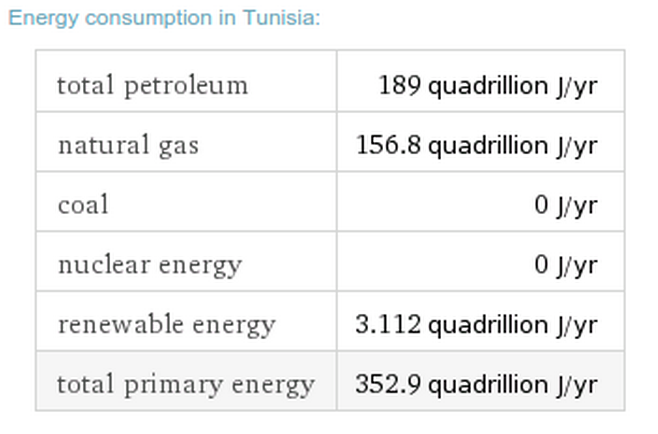
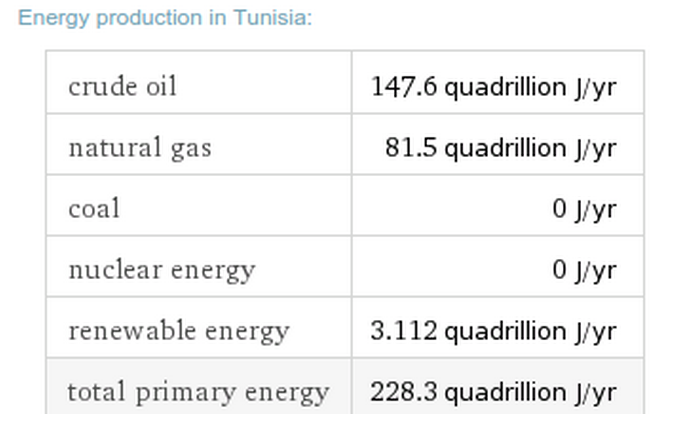

#The Pillar Of Energy In Tunisia

*Sabri Tlili Khlafallah*

Tunisia is an Arabic state in North Africa with 163 610 kilometer square of total Area, and 12 millions of population.
Tunisia is known for the first Arabic spring revolution, and for it’s democratic experience, even if the economy of the state is getting always worse, and the corruption is always present, all of this in a (banale che fa ridere e pieno di chaos) political scene.
But without getting out from our topic this table show us the Energy consumption in Tunisia:

as we can see Oil and Natural gas get’s the most of it, renewable get’s only 0.88% of Total Energy consumption.

Similar to the Energy consumption Oil and Natural gas are the main energetical products in Tunisia, the renewable energy production is only the 1.36% of the total primary energy production.
In the last period in Tunisia started a Campaign in Facebook, that by the way had an enormous role in the revolution, it was the voice of the people, the only way to communicate what was happening in the field.
Anyhow the Campaing is called “Winou elPetrol?” that means “Where’s the oil?” this campaign allowed to introduce into public debate the issue of natural resource management in the country whatsoever Oil, phosphate, Natural gas, salt, etc.
There's this knowledge revolution happening in Tunisia, the first revolution allowed tunisian to break the wall of fear and now we're fiercely asking for our rights, apparently from the colonialism years there were deals with the tunisian goverment of that time, Tunisians with this campaign are asking simply to get a transperancy for the Energy production and natural resources.
Well it may seems paradoxal but I support this campaign, the government should declare how much we have got, and who is usurping the Tunisian resources that's it.
I would like to encourage the investment of photovoltaic technology in Tunisia, but not before guaranteeing that our resources are manages wisely, and Tunisian gets (un livello di vita idoneo alle potenzialità dello stato), potenzialità nel senso di risorse di tutti I tipo.
So, "Winou elPetrole?" is a campaign very important to Tunisians, not because of oil and other resources, but simply because it is the base upon it we can build and move into better way to produce energy.
It is (punto di svolta) where public start to interact in a very important pillar as it is Energy.
Many Journalists, politicians are asking: why does this Campaig did not started 5 years ago with the revolution? And they're claiming that there is not any oil in tunisia ect...
Well it did but it hasn't get the attention that it is getting right now. 
So I personally think this is (giochi sporchi di politica)
I hope well in Tunisia and I'm sure that there's a bright future waiting for us.